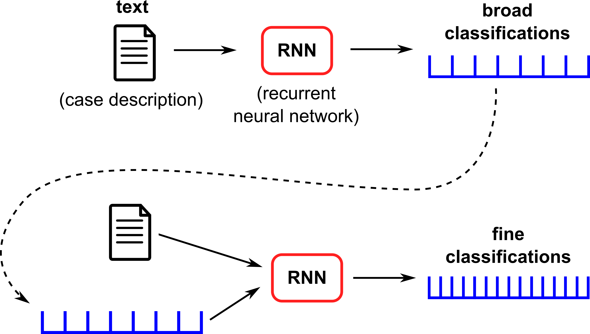
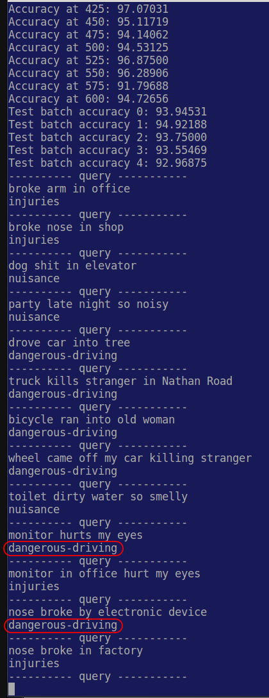
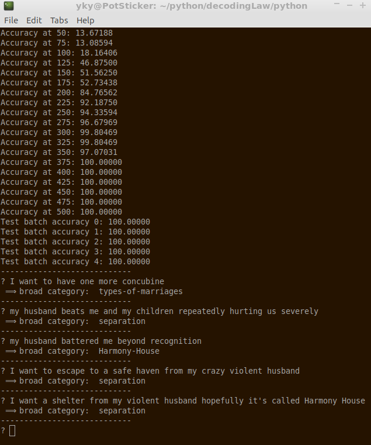

Deep learning toolset for legal domain
======================================

History -- we joined the following competitions:

* Global Legal Hackathon 2018, Decoding Law -- make law accessible for all
* Access to Justice Hackathon 2018, LegGo -- 21st-century legal information system

Quick start
-----------

Typically you'd want to install Tensorflow under Anaconda.

For example, download the Anachonda install script and run it:

     bash Anaconda3-5.1.0-Linux-x86_64.sh

Then create a Tensorflow environment called "tf":

    conda create -n tf pip python=3.6

Then activate the environment:

    source activate tf

You will see the command prompt changed.

Then install Tensorflow with:

    pip install tensorflow==1.5

(As of 2018 March, 1.6 seems to have a bug)

Then install NLTK toolkit with:

    conda install -c anaconda nltk

Then install NLTK corpus with:

    python
        import nltk
        nltk.download()

and choose "corpus" to download.

Then you can run our code:

    python main-RNN.py

Architecture
------------

Currently the code does stage 1, "broad classifications".

In the future we will try to do stage 2.

Demo
----

The demo classifies queries into 3 categories:

* nuisance
* dangerous driving
* work injuries

This is an example run:

New demo
--------

The new demo isn't very successful (more wrong than correct answers):

Now increased to 10 categories.

Notes on AI
-----------

The AI / deep learning aspects are discussed further in these notes:

[AI notes](https://docs.google.com/document/d/1CAl9KIEu7lMoS-bMONlDUtTW_LNE6sV5A40SRQX2wFQ/edit#heading=h.5dd6iulq0zwy)

We are currently trying to implement those ideas.
