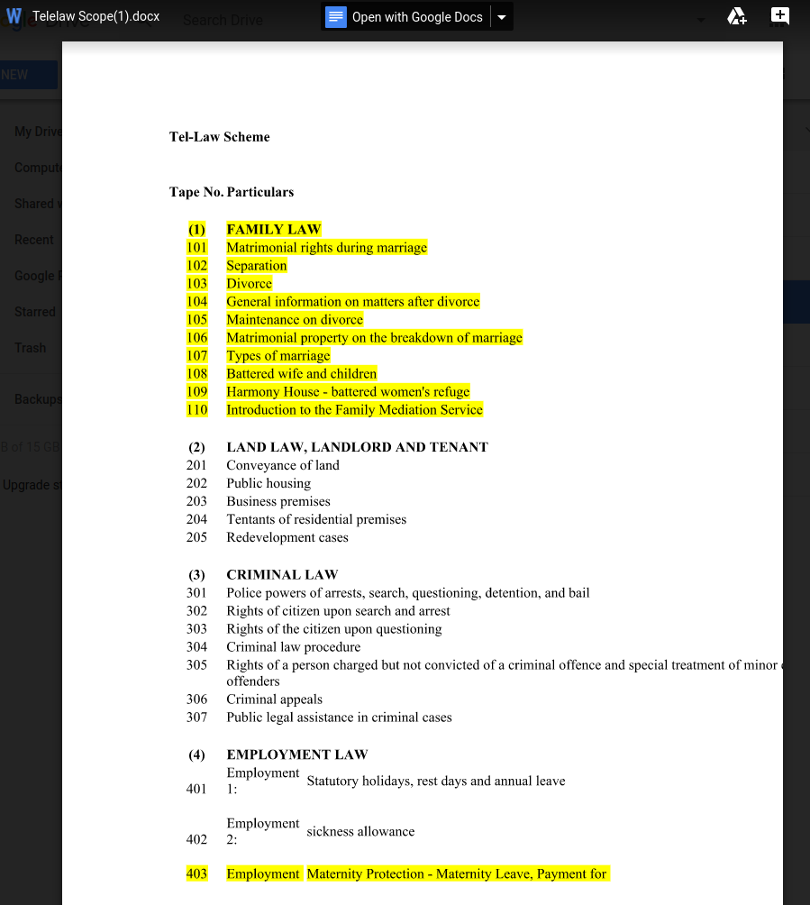

Deep learning toolset for legal domain
======================================

History -- we joined the following competitions:

* Global Legal Hackathon 2018, Decoding Law -- make law accessible for all
* Access to Justice Hackathon 2018, LegGo -- 21st-century legal information system

Quick start
-----------

Typically you'd want to install Tensorflow under Anaconda.

For example, download the **Anachonda** install script and run it:

     bash Anaconda3-5.1.0-Linux-x86_64.sh

Then create a Tensorflow environment called "tf":

    conda create -n tf pip python=3.6

Then activate the environment:

    source activate tf

You will see the command prompt changed.

Then install **Tensorflow** with:

    pip install tensorflow==1.5

(As of 2018 March, 1.6 seems to have a bug)

Then install **NLTK** toolkit with:

    conda install -c anaconda nltk

Then install **NLTK corpus** with:

    python
        import nltk
        nltk.download()

and choose "corpus" to download.

Lastly, download the **word vectors** file from either:

    fastText: https://fasttext.cc/docs/en/english-vectors.html
    (file name = wiki-news-300d-1M.vec.zip)

    or GloVe from Stanford:  https://nlp.stanford.edu/projects/glove/
    (file name = glove.840B.300d.zip)

Then **unzip** the file and put it in the directory ``\data``.  (Or you can modify the path in my code, it's possible to run with the zipped version directly.)

Then you can run our code:

    python main-RNN.py

Try out some queries after the ``?`` prompt.

Architecture
------------

Currently the code does stage 1, "broad classifications".

In the future we will try to do stage 2.

Demo
----

The demo classifies queries into 3 categories:

* nuisance
* dangerous driving
* work injuries

This is an example run:

New demo
--------

The new demo isn't very successful (more wrong than correct answers):

Now increased to 10 categories:

The above file is part of the decision tree used by a telephone inquiry system (TelLaw, provided by HK government).  Each sub-topic is associated with a pre-recorded message of ~500 words' length.  Since the message text is not long, and the sub-categories are all very similar (under FAMILY LAW), our AI does not perform very well, but there may be ways to improve it.

Notes on AI
-----------

The AI / deep learning aspects are discussed further in these notes:

[AI notes](https://docs.google.com/document/d/1CAl9KIEu7lMoS-bMONlDUtTW_LNE6sV5A40SRQX2wFQ/edit#heading=h.5dd6iulq0zwy)

We are currently trying to implement those ideas.
